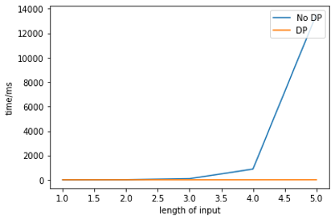

## Step 1: Autocomplete the location name
```c++
std::vector<std::string> Autocomplete(std::string name);
```
### Description:
1. Traverse all nodes on the map.
2. If the size of input is greater than the size of node’s name, we skip this node.
3. Otherwise, convert input name and node's name to lower cases. 
4. Then, compare input name and substring of node name from the beginning which have same length.
5. If they are equal, push the node name into result vector.
### Examples:
1. chi ==> Chinese Street Food, Chick-fil-A, Chipotle.\
Time taken by function: 4 ms
2. w ==> Washington & Broadway 1, Washington & Hope, Washington & Union 2, Washington & Hoover, Washington & Bonnie Brae, Washington & Union, Washington & Cherry, Washington & Figueroa 1,Washington & Figueroa, Washington & Vermont, Washington & Budlong, Washington & Normandie, Washington & Harvard, Washington & Westmoreland, Washington & Mariposa, Western & Exposition, Western & 36th, Western & Adams 3, Western & Adams 2, Western & Adams, Western & 24th 1, Western & 10 Off-ramp 1, Western & Washington, Western & 10 Off-ramp, Washington & Western, Washington & Arlington, Workshop Salon & Boutique, Warning Skate Shop, Western & 24th, Western & Jefferson 1, Washington & Olive, Western & Adams 1, Western & 29th 1, Wadsworth Elementary School, Western & Exposition 1, West Vernon Elementary School, Washington & Gramercy, Western & 29th, Which Wich?
, Washington 1, Washington & Flower, Washington, Washington Boulevard School, Western & 36th 1, Western Avenue Christian Church, West Adams Presbyterian Church, Ward African Methodist Episcopal Church, Westvern Station Los Angeles Post Office, Westminster Presbyterian Church, Washington & Union 1, Washington & Oak, Washington & Grand 1, Walker Temple African Methodist Episcopal Church, Washington & Grand, Washington & Oak 1, Washington & New England, West Side Church of God, Washington & Broadway, Western & Jefferson, Washington & Bonsallo\
Time taken by function: 5 ms
3. s ==> Stimson House, Saint Cecilia School, Smoke Shop, Stout Burger, St Agnes Church, Security Checkpoint, Shall Gas, Social Security Administration, SunLife Organics, Student Union (STU),Starbucks 3, San Pedro Street 2, Starbucks 2, Safety Pole, San Julian & 12th, Starbucks 1, Spiritual Fellowship Church, Studio 423, Soles Bicycles, San Pedro Street 1, Starbucks, St. Philips Episcopal Church, St. Johns Cathedral-Hope Net, Saint Lukes Missionary Baptist Church, San Pedro Street, Subway, Saint Agnes Elementary School, Saint James Park, Shell, Subway 1, Saint Marks Lutheran Church, Santa Barbara Avenue School, Sonny Astani School of Civil Engineering, Strangers Rest Baptist Church, Saint Patrick School, Sweet illusion, Second Baptist Church, Senshin Buddhist Church, Saint Patricks Catholic Church, Servants of Mary Convent, Saint John Baptist Church, Saint Phillips Episcopal Church, Schoenfeld Symphonic Hall, Safety Pole 1, St. Francis Center - Food Bank\
Time taken by function: 5 ms
### Observation:
Different size of inputs need roughly the same time because we need to traverse all nodes in the data. Time complexity is O(n), n is number of nodes. When we type in longer name, running time will decrease a little because we can skip more nodes with shorter name.

## Step 2-1: Find the place's Coordinates in the Map
```c++
std::pair<double, double> GetPosition(std::string name);
```
### Description:
1. Traverse all nodes on the map.
2. If the name of input is equal to one node’s name, return this node latitude and longitude.
### Examples:
1. 
```shell
Please input a location:Hill & Adams
*************************Results******************************
Latitude: 34.0262 Longitude: -118.27
**************************************************************
Time taken by function: 5 ms
```
2. 
```shell
Please input a location:Central Adult Senior High
*************************Results******************************
Latitude: 34.0338 Longitude: -118.267
**************************************************************
Time taken by function: 5 ms
```
3. 
```shell
Please input a location:Expo/Western 1
*************************Results******************************
Latitude: 34.0184 Longitude: -118.31
**************************************************************
Time taken by function: 3 ms
```
### Observation:
Time complexity in worst case should be O(n) in which n is number of nodes. 

## Step 2-2: Check edit distance between two location names
### Description:
### 1. Helper Function
```c++
int CalculateEditDistance(std::string a, std::string b);
```
1. Create vector "res" with shape (a.length+1, b.length+1). Initialize the base case, for example:\
a.length = 3, b.length = 2;\
    [0,1,2,3,4]\
    [1,0,0,0,0]\
    [2,0,0,0,0]
2. From i = 1, j = 1, using following equation to update:\
    if the i-1th character of a == the j-1th character of b, res[i][j] = min(res[i-1][j], res[i][j-1], res[i-1][j-1])\
    if the i-1th character of a != the j-1th character of b, res[i][j] = min(res[i-1][j], res[i][j-1], res[i-1][j-1])+1
3. Finally, return bottom-right corner element of res, which is res[a.length()][b.length()]
### Observation:
Time complexity is O((a.length+1) * (b.length+1)) and Memory size is (a.length+1) * (b.length+1)
### 2. Main Function
```c++
std::string FindClosestName(std::string name);
```
1. Initilize "min" as INT_MAX, "tmp" as empty string. Traverse all nodes on the map. 
2. If EditDistance between input name and node's name is less than "min", update min to current EditDistance and update tmp to current node's name.
3. Finally, return the ClosestName "tmp"
### Examples:
1. 
```shell
Please input a location:Hill & 11
*************************Results******************************
No matched locations.
Did you mean Hill & 11th instead of Hill & 11? [y/n]y
Latitude: 34.04 Longitude: -118.26
**************************************************************
Time taken by function: 5 ms
```
2. 
```shell
Please input a location:KF
*************************Results******************************
No matched locations.
Did you mean KFC instead of KF? [y/n]y
Latitude: 34.0261 Longitude: -118.278
**************************************************************
Time taken by function: 3 ms
```
3. 
```shell
Please input a location:Rolphs
*************************Results******************************
No matched locations.
Did you mean Ralphs instead of Rolphs? [y/n]y
Latitude: 34.0318 Longitude: -118.291
**************************************************************
Time taken by function: 5 ms
```
### Observation:
Assume maximum length of node's name is L, the number of nodes is n. In worst case, the running time is L*n, so the time complexity is O(n). Therefore, the function time when we type in wrong name is roughtly same as the function time when we type in right name.
I compare the alogorithm with/without dynamic programming, it shows exponential time complexity grow very fast.
<p align="center"></p>

## Step 3: CalculateShortestPath between two places
### Description:
#### 1. Dijkstra
```c++
std::vector<std::string> CalculateShortestPath_Dijkstra(std::string &location1_name,
                                               std::string &location2_name);
```
1. 
"res" store result of IDs\
"source" get start node ID\
"target" get end node ID\
"q" priority queue to update the minimum of distance,\
in the queue std::pair<double, std::string> make sure it will compare double variable first\
"marks" sets being visited node as 1, mark already visited node as 2\
"pre" updates previous node
```c++
std::vector<std::string> res; // store result of IDs
std::string source = GetID(location1_name); // get start node ID
std::string target = GetID(location2_name); // get target node ID
/* priority queue to update the minimum of distance, in the queue
std::pair<double, std::string> make sure it will compare double variable first
*/
std::priority_queue<std::pair<double, std::string>,
    std::vector<std::pair<double, std::string>>,
    std::greater<std::pair<double, std::string>>>q;
// mark being visited node as 1, mark already visited node as 2
std::map<std::string, int> marks;
// update previous node
std::map<std::string, std::string> pre;
```
2. 
create the distance map for initial case when none node is visited 
```c++
// create the distance map for initial case when none node is visited 
std::map<std::string, double> distances;
distances[source] = 0.0;
```
3. 
When q is not empty, 
pop out the minimum of distance in the queue, let already visited nodes in the queue pop out if they are minimum.\
mark being visited node as 1.\
traverse neighbors of being visited node\
if neighbor node is unvisited, calculate new distance from being visited node to this neighbor node\
compare the already stored distance with new distance, if new distance smaller, update distance and previous node of this neighbor node\
change being visited node to already visited node\
when target node is being visited, stop loop
```c++
q.push(std::make_pair(0.0, source));
while (!q.empty())
{
  std::string u = q.top().second;
  q.pop();//pop out the minimum of distance in the queue
  while (marks[u] == 2)
  {
 // let already visited nodes in the queue pop out if they are minimum
    u = q.top().second;
    q.pop();
  }
 // mark being visited node as 1
  marks[u] = 1;
  if (u == target)
  {
 //when target node is being visited stop loop
    break;
  }
  for (auto &child : data[u].neighbors)
  {// traverse neighbors of being visited node 
    if (marks.find(child) == marks.end())
    {// if neighbor node is unvisited,
        if (distances.find(child) == distances.end())
        {// if this node don't have distance meaning it's infinite, directly update its distance
          double alt = distances[u] + CalculateDistance(u, child);
          // calculate new distance from being visited node to this neighbor node
          distances[child] = alt;
          q.push(std::make_pair(alt, child));
          pre[child] = u;
        }
        else
        {
          double alt = distances[u] + CalculateDistance(u, child);
          // calculate new distance from being visited node to this neighbor node
          if (distances[child] > alt)
          {//compare the already stored distance with new distance
          // if new distance smaller, update distance and previous node of this neighbor node 
            distances[child] = alt;
            q.push(std::make_pair(alt, child));
            pre[child] = u;
          }
        }
    }
  }
  //change being visited node to already visited node
  marks[u] = 2;
}
```
4. 
use pre map to backtrack the path from target node to start node\
reverse the result of IDs 
```c++
if (marks[target] == 1)
{//use pre map to backtrack the path from target node to start node
  res.push_back(target);
  while (target != source)
  {
    target = pre[target];
    res.push_back(target);
  }
  //reverse the result of IDs 
  std::reverse(res.begin(), res.end());
}
```
#### 2. Bellman_Ford
Helper Function:\
GetPredecessors() for getting all of precessors of each nodes
```c++
std::map<std::string, std::vector<std::string>> GetPredecessors();
```
Main Function:
```c++
std::vector<std::string> CalculateShortestPath_Bellman_Ford(std::string &location1_name,
                                               std::string &location2_name);
```
1. 
"path" store result of path\
"distance" update distances from source to all of other nodes\
"source" get start node ID\
"target" get target node ID\
"pre_path" update previous node
```c++
  std::vector<std::string> path;// store result of path
  std::map<std::string, double> distance;// update distances from source to all of other nodes
  std::string source = GetID(location1_name);// get start node ID
  std::string target = GetID(location2_name);// get target node ID
  std::map<std::string, std::string> pre_path;// update previous node
```
2. 
initialize distance map when we allow zero edge
```c++
  double infinite = std::numeric_limits<double>::max();
  std::map<std::string, std::vector<std::string>> predecessor = GetPredecessors();
  for (auto &node : predecessor)
  {// initialize distance map when we allow zero edge
    distance[node.first] = infinite;
  }
  distance[source] = 0.0;
```
3. 
let N is node number, from 0 to N-2, totally N-1 times\
traverse all node\
then traverse all predecessors of this node\
if distance from start to this predecessor is not infinite which means there is a path,\
then compare original distance with new distance from start to this node through this predecessor\
when distance from start to target is unchanged, count add one\
when count is over 9 which means distance is unchanged over 9 times, stop loop
```c++
  int count = 0;
  for (int i = 0; i < predecessor.size() - 1; i++)
  { // let N is node number, from 0 to N-2, totally N-1 times
    double tmp = distance[target];
    for (auto &node : predecessor)
    {// traverse all node
      for (auto &p : node.second)
      {// then traverse all predecessors of this node
        if (distance[p] < infinite)
        {// if from start to this predecessor is not infinite which means there is a path, then compare original distance with new distance from start to this node through this predecessor 
          double asl = distance[p] + CalculateDistance(p, node.first);
          if (asl < distance[node.first])
          {
            distance[node.first] = asl;
            pre_path[node.first] = p;
          }
        }
      }
      if (tmp != infinite && node.first == target && tmp == distance[target])
      {// when distance from start to target is unchanged, count add one
        count++;
      }
    }
    if (count > 9)
    {//when unchanged time is over 9, stop loop
      break;
    }
  }
```
4. 
use pre_path map to record the path from target node to start node\
reverse the result of IDs 
```c++
  if (distance[target] != infinite)
  {
    path.push_back(target);
    while (target != source)
    {
      target = pre_path[target];
      path.push_back(target);
    }
    std::reverse(path.begin(), path.end());
  }
```
### Examples:
1. 
```shell
Please input the start location:Pico & Grand 1
Please input the destination:Arco
*************************Dijkstra*****************************
*************************Results******************************
"9601938171","3402868024","5344542576","69196947","3663662931","122704147","6808035754","6805137655","7863423172","123281089","8395566137","9598396764","122648660","4040002632","3663661823","60957905","7278984140","7278984139","3402816637","3663661816","3402866621","3402866622","3663661813","3402866623","6792287104","6792287107","6792287109","6792287111","6792287108","6792287106","6792287119","6792287115","6792287117","6792287116","269987071","269987072","4400709273","4400709274","269988119","2193435064","269987146","5680945541","122665895","7863404959","7225140896","7225140901","5680945530","21098545","7566035005","4019967068","5631579860","4019967069","7362236498","29098662","25522209","4019956954","123315776","123261489","123689317","7226309209","123132702","7226309208","7226309201","7249602265","4019957020","7249602275","123656778","277328163","7249602283","6807262772","6807487606","123454993","123250860","123250863","6816193730","6816180153","122740200","6816180152","6816193731","8229902776","8229902773","6987314775","6816193739","122674587","6816193743","544713885","6816193747","122740204","6816193751","544713893","8229902761","8229902760","591042107",
The distance of the path is:1.66856 miles
**************************************************************
Time taken by function: 122 ms

*************************Bellman_Ford*************************
*************************Results******************************
"9601938171","3402868024","5344542576","69196947","3663662931","122704147","6808035754","6805137655","7863423172","123281089","8395566137","9598396764","122648660","4040002632","3663661823","60957905","7278984140","7278984139","3402816637","3663661816","3402866621","3402866622","3663661813","3402866623","6792287104","6792287107","6792287109","6792287111","6792287108","6792287106","6792287119","6792287115","6792287117","6792287116","269987071","269987072","4400709273","4400709274","269988119","2193435064","269987146","5680945541","122665895","7863404959","7225140896","7225140901","5680945530","21098545","7566035005","4019967068","5631579860","4019967069","7362236498","29098662","25522209","4019956954","123315776","123261489","123689317","7226309209","123132702","7226309208","7226309201","7249602265","4019957020","7249602275","123656778","277328163","7249602283","6807262772","6807487606","123454993","123250860","123250863","6816193730","6816180153","122740200","6816180152","6816193731","8229902776","8229902773","6987314775","6816193739","122674587","6816193743","544713885","6816193747","122740204","6816193751","544713893","8229902761","8229902760","591042107",
The distance of the path is:1.66856 miles
**************************************************************
Time taken by function: 6616 ms
```
2. 
```shell
Please input the start location:Ralphs
Please input the destination:Target
*************************Dijkstra*****************************
*************************Results******************************
"2578244375","4380040154","4380040158","4380040167","6805802087","8410938469","6813416131","7645318201","6813416130","6813416129","123318563","452688940","6816193777","123408705","6816193774","452688933","452688931","123230412","6816193770","6787470576","4015442011","6816193692","6816193693","6816193694","4015377691","544693739","6816193696","6804883323","6807937309","6807937306","6816193698","4015377690","4015377689","122814447","6813416159","6813405266","4015372488","4015372487","6813405229","122719216","6813405232","4015372486","7071032399","4015372485","6813379479","6813379584","6814769289","5237417650",
The distance of the path is:0.927969 miles
**************************************************************
Time taken by function: 56 ms

*************************Bellman_Ford*************************
*************************Results******************************
"2578244375","4380040154","4380040158","4380040167","6805802087","8410938469","6813416131","7645318201","6813416130","6813416129","123318563","452688940","6816193777","123408705","6816193774","452688933","452688931","123230412","6816193770","6787470576","4015442011","6816193692","6816193693","6816193694","4015377691","544693739","6816193696","6804883323","6807937309","6807937306","6816193698","4015377690","4015377689","122814447","6813416159","6813405266","4015372488","4015372487","6813405229","122719216","6813405232","4015372486","7071032399","4015372485","6813379479","6813379584","6814769289","5237417650",
The distance of the path is:0.927969 miles
**************************************************************
Time taken by function: 4130 ms
```
3. 
```shell
Please input the start location:Exposition & Harvard 1
Please input the destination:Arco
*************************Dijkstra*****************************
*************************Results******************************
"8530535266","63051646","123112838","211752888","4009744690","122625129","5088278823","123019480","270840202","6805054063","1878026183","122602815","1878026181","7644975623","122602812","1473199427","1473199422","123587177","1473199418","6792034226","123152312","4015203110","4872897006","6814955794","4872897005","4872897003","1732243553","6814770334","4399697322","6814770333","123195197","123209598","6819180185","1732243889","6819179784","6819179778","123258022","7190430823","6814770360","6814770361","6814620877","6814620876","6814620875","4399698003","1286136450","6818390139","63068610","6813379474","1849116067","1849116062","1849116064","6047218633","1849116060","6229624525","1849116069","1849116072","1849116066","7591500906","7591500904","7591500907","7591500903","7591500902","7591500901","7591500900","7591500905","122719255","2613117893","6818390155","6818390154","6813405230","6813405229","4015372487","4015372488","6813405266","6813416159","122814447","4015377689","4015377690","6816193698","6807937306","6807937309","6804883323","6816193696","544693739","4015377691","6816193694","123408740","6816193690","4015377692","2514542031","1922565218","6816180168","6380132756","6816180170","4015377693","1843466234","122674590","6816193759","4015124654","4015124655","6816193753","6816193752","6816193751","544713893","8229902761","8229902760","591042107",
The distance of the path is:2.2864 miles
**************************************************************
Time taken by function: 178 ms

*************************Bellman_Ford*************************
*************************Results******************************
"8530535266","63051646","123112838","211752888","4009744690","122625129","5088278823","123019480","270840202","6805054063","1878026183","122602815","1878026181","7644975623","122602812","1473199427","1473199422","123587177","1473199418","6792034226","123152312","4015203110","4872897006","6814955794","4872897005","4872897003","1732243553","6814770334","4399697322","6814770333","123195197","123209598","6819180185","1732243889","6819179784","6819179778","123258022","7190430823","6814770360","6814770361","6814620877","6814620876","6814620875","4399698003","1286136450","6818390139","63068610","6813379474","1849116067","1849116062","1849116064","6047218633","1849116060","6229624525","1849116069","1849116072","1849116066","7591500906","7591500904","7591500907","7591500903","7591500902","7591500901","7591500900","7591500905","122719255","2613117893","6818390155","6818390154","6813405230","6813405229","4015372487","4015372488","6813405266","6813416159","122814447","4015377689","4015377690","6816193698","6807937306","6807937309","6804883323","6816193696","544693739","4015377691","6816193694","123408740","6816193690","4015377692","2514542031","1922565218","6816180168","6380132756","6816180170","4015377693","1843466234","122674590","6816193759","4015124654","4015124655","6816193753","6816193752","6816193751","544713893","8229902761","8229902760","591042107",
The distance of the path is:2.2864 miles
**************************************************************
Time taken by function: 11439 ms
```
### Observation:
the time complexity of Dijkstra is O(m logn + n logn), the time complexity of Bellman_Ford is O(n*m). As expected, when the number of nodes is large like here 18359, the time between them has a huge difference. And because we can stop early, the longer the path is, the longer the running time will be. Here is figure which compares several examples.
<p align="center"></p>

## Step 4: The Travelling Trojan Problem (AKA Travelling Salesman!)
### Description:
#### 1. Brute-froce & Brute-force with early backtracking
1. Help Function for Brute-froce & Brute-force with early backtracking
Use bool variable isBacktracking to control whether using early backtracking\
base case:\
when current path size is equal to number of locations, A->B->C\
add the distance from end node back to start A->B->C->A\
if this leaf final distance is smaller than smallest one of previous leaves, update\
backtracking:\
if use backtracking\
when current cost is already larger than smallest distance, there is no need to continue because the distance is positive\
main loop:\
I will definitely add starting node, so start from the next node\
If this i node is already in the current path, continue loop\
otherwise, update current cost by adding distance from current node to this i node
```c++
void TrojanMap::TravellingTrojan_helper(
    int cur_node, double cur_cost, std::vector<std::string> &cur_path,
    std::pair<double, std::vector<std::vector<std::string>>> &records,
    std::vector<std::string> &location_ids, bool &isBacktracking)
{
  if (cur_path.size() == location_ids.size())
  {// when current path size is equal to number of locations, A->B->C
    double final_cost = cur_cost + CalculateDistance(location_ids[cur_node], location_ids[0]);
    //add the distance from end node back to start A->B->C->A
    if (final_cost < records.first)
    {// if this leaf final distance is smaller than smallest one of previous leaves, update
      records.first = final_cost;
      cur_path.push_back(location_ids[0]);// add A in the end
      records.second.push_back(cur_path);
      cur_path.pop_back();
    }
    return;
  }
  if (isBacktracking)
  {// if use backtracking
    if (cur_cost >= records.first)
    {// when current cost is already larger than smallest distance, there is no need to continue because the distance is positive
      return;
    }
  }

  for (int i = 1; i < location_ids.size(); i++)
  {// I will definitely add starting node, so start from the next node
    if (std::find(cur_path.begin(), cur_path.end(), location_ids[i]) != cur_path.end())
    {// If this i node is already in the current path, continue loop
      continue;
    }
    cur_path.push_back(location_ids[i]);// push back this i node into current path
    TravellingTrojan_helper(i, cur_cost + CalculateDistance(location_ids[cur_node], location_ids[i]), cur_path, records, location_ids, isBacktracking);
    // update current cost by adding distance from current node to this i node
    cur_path.pop_back();// pop out this i node
  }
}
```
2. 
Same way for these two function\
if location_ids is empty, return empty records\
otherwise, records.first store the minimum distance, set infinite\
define current path and add the first node into it\
current node sets as 0, current cost sets as 0.0
```c++
std::pair<double, std::vector<std::vector<std::string>>> TrojanMap::TravellingTrojan_Brute_force(
    std::vector<std::string> location_ids)
{
  std::pair<double, std::vector<std::vector<std::string>>> records;
  if (location_ids.empty())
    return records;
  records.first = std::numeric_limits<double>::max();
  std::vector<std::string> cur_path{location_ids[0]};
  bool isBacktracking = false;
  TravellingTrojan_helper(0, 0.0, cur_path, records, location_ids, isBacktracking);
  return records;
}

std::pair<double, std::vector<std::vector<std::string>>> TrojanMap::TravellingTrojan_Backtracking(
    std::vector<std::string> location_ids)
{
  std::pair<double, std::vector<std::vector<std::string>>> records;
  if (location_ids.empty())
    return records;
  records.first = std::numeric_limits<double>::max();
  std::vector<std::string> cur_path{location_ids[0]};
  bool isBacktracking = true;
  TravellingTrojan_helper(0, 0.0, cur_path, records, location_ids, isBacktracking);
  return records;
}
```
#### 2. 2OPT
1. TwoOptSwap function to change the order of nodes as expected
reverse part of nodes except the begining node,\
e.g. 0,1,2,3,4,5,6,7,0->TwoOptSwap(4,7)->0,1,2,3,7,6,5,4,0\
so, std::reverse range from begin+i to begin+k+1
```c++
std::vector<std::string> TrojanMap::TwoOptSwap(int i, int k, std::vector<std::string> location_ids)
{
  std::reverse(location_ids.begin() + i, location_ids.begin() + k + 1);
  return location_ids;
}
```
2. main body
initialization:\
push back the begining node to the location_ids\
calculate whole distance in the orginal order, and assign it to records.first\
push back the first path into records.second\
set breakflag to stop loop\
unchanged used to control how many times to restart the loop from unchanged state, here I set as 10, the number is larger, the result will be more accurate\
main loop:
if the following loop cannot set unchange as 0, unchanged will add one\
only when change occurs in the following loop, we will break\
i should from 0 to size-3, because the vector needed revers will be 0,1,2,3,4,0, so the index from 0 to size-1, but size-1 are original node, so i should from 0 to the index before size-2 which is size-3\
k should from i+1 to size - 2\
swap i, k from records.second.back() which is previous best order of nodes\
calculate the distance of the new order of nodes\
if new distance is smaller than previous best, update
```c++
std::pair<double, std::vector<std::vector<std::string>>> TrojanMap::TravellingTrojan_2opt(
    std::vector<std::string> location_ids)
{
  std::pair<double, std::vector<std::vector<std::string>>> records;
  if (location_ids.empty())// location_ids is empty, return empty records
    return records;

  location_ids.push_back(location_ids[0]);// push back the begining node
  records.first = CalculatePathLength(location_ids);
  // calculate whole distance in the orginal order, and assign it to records.first
  records.second.push_back(location_ids);// push back the first path into records.second
  bool breakflag = false;
  int size = location_ids.size();
  int unchanged = 0;// unchanged used to control how many times to restart the loop from unchanged state

  while (unchanged < 10)// here I set as 10
  {
    unchanged++;// if the following loop cannot set unchange as 0, unchanged will add one
    breakflag = false;// only when change occurs in the following loop, we will break
    for (int i = 1; i < size - 2; i++)
    {// i should from 0 to size-3, because the vector needed revers will be 0,1,2,3,4,0, 
    // so the index from 0 to size-1, but size-1 are original node, so i should from 0 to the index before size-2 which is size-3
      for (int k = i + 1; k < size - 1; k++)
      {// k should from i+1 to size - 2
        std::vector<std::string> cur_ids = records.second.back();
        cur_ids.pop_back();
        std::vector<std::string> new_ids = TwoOptSwap(i, k, cur_ids);
        // swap i, k from records.second.back() which is previous best order of nodes
        new_ids = correct_order(new_ids, source);
        //put the source back to the first place
        new_ids.push_back(source);
        double new_distance = CalculatePathLength(new_ids);
        //calculate the distance of the new order of nodes
        if (new_distance < records.first)
        {// if new distance is smaller than previous best, update
          unchanged = 0;
          records.first = new_distance;
          records.second.push_back(new_ids);
          breakflag = true;
          break;
        }
      }
      if (breakflag)
        break;
    }
  }
  return records;
}
```
#### 3. 3OPT
1. 
3opt has very different segments from 2opt
```c++
std::vector<std::vector<int>> TrojanMap::all_segments(int N)
```
<p align="center"></p>

2. 
Need a function to put the source point back to the first place
```c++
std::vector<std::string> TrojanMap::correct_order(std::vector<std::string> ids, std::string source)
```
<p align="center"></p>

3. 
Each segment has 8 cases, and we need to find the best one. And reverse corresponding nodes
```c++
std::vector<std::string> TrojanMap::ThreeOptSwap(std::vector<int> segment, std::vector<std::string>& ids)
```
<p align="center"></p>

4. 
Main body same as 2opt:
```c++
std::pair<double, std::vector<std::vector<std::string>>> TrojanMap::TravellingTrojan_3opt(
    std::vector<std::string> location_ids)
```
### Examples:
1. 
```shell
Please input the number of the places:8
"122673039","6807241424","8411284372","8229902765","6819220739","5249489003","7697759353","6813379408",
Calculating ...
*************************Results******************************
TravellingTrojan_Brute_force
"122673039","8411284372","7697759353","6819220739","6807241424","6813379408","8229902765","5249489003","122673039",
The distance of the path is:9.10552 miles
**************************************************************
You could find your animation at src/lib/output0.avi.          
Time taken by function: 40 ms

Calculating ...
*************************Results******************************
TravellingTrojan_Backtracking
"122673039","8411284372","7697759353","6819220739","6807241424","6813379408","8229902765","5249489003","122673039",
The distance of the path is:9.10552 miles
**************************************************************
You could find your animation at src/lib/output0_backtracking.avi.
Time taken by function: 24 ms

Calculating ...
*************************Results******************************
TravellingTrojan_2opt
"122673039","5249489003","8229902765","6813379408","6807241424","6819220739","7697759353","8411284372","122673039",
The distance of the path is:9.10552 miles
**************************************************************
You could find your animation at src/lib/output0_2opt.avi.     
Time taken by function: 22 ms

Calculating ...
*************************Results******************************
TravellingTrojan_3opt
"122673039","5249489003","8229902765","6813379408","6807241424","6819220739","7697759353","8411284372","122673039",
The distance of the path is:9.10552 miles
**************************************************************
You could find your animation at src/lib/output0_3opt.avi.     
Time taken by function: 57 ms
```
2. 
```shell
Please input the number of the places:9
"1870797815","7078979725","6807395776","1837208747","4536989626","2613066346","1855147948","7197997722","4343588842",
Calculating ...
*************************Results******************************
TravellingTrojan_Brute_force
"1870797815","1837208747","4343588842","7197997722","7078979725","4536989626","6807395776","2613066346","1855147948","1870797815",
The distance of the path is:9.69898 miles
**************************************************************
You could find your animation at src/lib/output0.avi.          
Time taken by function: 325 ms

Calculating ...
*************************Results******************************
TravellingTrojan_Backtracking
"1870797815","1837208747","4343588842","7197997722","7078979725","4536989626","6807395776","2613066346","1855147948","1870797815",
The distance of the path is:9.69898 miles
**************************************************************
You could find your animation at src/lib/output0_backtracking.avi.
Time taken by function: 117 ms

Calculating ...
*************************Results******************************
TravellingTrojan_2opt
"1870797815","1837208747","4343588842","7197997722","7078979725","4536989626","6807395776","2613066346","1855147948","1870797815",
The distance of the path is:9.69898 miles
**************************************************************
You could find your animation at src/lib/output0_2opt.avi.     
Time taken by function: 31 ms

Calculating ...
*************************Results******************************
TravellingTrojan_3opt
"1870797815","1855147948","2613066346","6807395776","4536989626","7078979725","7197997722","4343588842","1837208747","1870797815",
The distance of the path is:9.69898 miles
**************************************************************
You could find your animation at src/lib/output0_3opt.avi.     
Time taken by function: 93 ms
```
3. 
```shell
Please input the number of the places:10
"4343588840","6807363047","277328160","7874235091","5941210619","8566227621","6798340979","269635440","2611833617","123112851",
Calculating ...
*************************Results******************************
TravellingTrojan_Brute_force
"4343588840","7874235091","269635440","2611833617","5941210619","8566227621","277328160","6798340979","6807363047","123112851","4343588840",
The distance of the path is:10.9293 miles
**************************************************************
You could find your animation at src/lib/output0.avi.          
Time taken by function: 3107 ms

Calculating ...
*************************Results******************************
TravellingTrojan_Backtracking
"4343588840","7874235091","269635440","2611833617","5941210619","8566227621","277328160","6798340979","6807363047","123112851","4343588840",
The distance of the path is:10.9293 miles
**************************************************************
You could find your animation at src/lib/output0_backtracking.avi.
Time taken by function: 395 ms

Calculating ...
*************************Results******************************
TravellingTrojan_2opt
"4343588840","7874235091","269635440","2611833617","5941210619","8566227621","277328160","6798340979","6807363047","123112851","4343588840",
The distance of the path is:10.9293 miles
**************************************************************
You could find your animation at src/lib/output0_2opt.avi.     
Time taken by function: 44 ms

Calculating ...
*************************Results******************************
TravellingTrojan_3opt
"4343588840","7874235091","269635440","2611833617","5941210619","8566227621","277328160","6798340979","6807363047","123112851","4343588840",
The distance of the path is:10.9293 miles
**************************************************************
You could find your animation at src/lib/output0_3opt.avi.     
Time taken by function: 156 ms
```

### Observation:
It will take very long time for Brute-Force way after 10, so I only plot the compare picture from 4 to 10. As expected, the Brute-Force's time complexity is O(n!), so it will grow very fast, and the early backtracking can reduce a lot of time. The 2opt way's time complexity is O(n^2), so when the largest input is just 10, the time is very small. However, when input number increases, I need to increase unchanged variable to get real smallest distance. And I also compare the distance. 2opt and 3opt may not get best result.
<p align="center"></p>
<p align="center"></p>
<p align="center"></p>

## Step 5: Cycle Detection

```c++
bool CycleDetection(std::vector<double> &square);
```
### Description:
1. 
inSquare function checks whether one node is in the square
```c++
bool inSquare(std::string id, std::vector<double> &square);
```
2. 
GetSubgraph function gets all of nodes in the square
```c++
std::vector<std::string> GetSubgraph(std::vector<double> &square);
```
3. 
CycleHelper function check whether there is a cycle in the part of graph which is considered as undirected graph based on DFS idea.
```c++
bool CycleHelper(std::string current_id, std::map<std::string, int> &marks,
                            std::string parent_id, std::vector<double> &square,
                            std::map<std::string, std::string> &pre,
                            std::string &end, std::string &start)
```
details:
```c++
  marks[current_id] = 1; // mark current node as 1
  for (const auto &child_id : data[current_id].neighbors)
  {// traverse all of children node of current node
    if (inSquare(child_id, square))
    {// we can only visit child nodes in the square
      if (marks[child_id] == 1 && child_id != parent_id)
      {// if child node is already visited which means already marked as 1 and it's not current node's parent node which is "parent_id", then cycle exists
        end = current_id;// current node is cycle end node
        start = child_id;// already visted child_node is cycle start node
        return true;
      }
      if (marks[child_id] != 1)
      {// if child node is not visited, then start recursive funtion to go deep
        if (CycleHelper(child_id, marks, current_id, square, pre, end, start))
        {// if from child graph cycle exits, return true
          return true;
        }
      }
    }
  }
  // traverse all of nodes in this part of graph, return false
  return false;
```
4. 
```c++
bool CycleDetection(std::vector<std::string> &subgraph, std::vector<double> &square);
```
From the first node, use CycleHelper function to detect cycle.\
And use pre map to record path points and store it in user defined varibale CyclePath.
```c++
std::vector<std::string> CyclePath;
```
If there's not a cycle, use CycleHelper function to detect cycle from another unvisited node.\
If all nodes are already visited, return false.
```c++
  std::map<std::string, int> marks;
  std::map<std::string, std::string> pre;
  std::vector<std::string> path;
  std::string end;
  std::string start;
  for (const auto &node : subgraph)
  {
    if (marks[node] != 1)
    {
      if (CycleHelper(node, marks, "", square, pre, end, start))
      {
        path.push_back(end);
        while (end != start)
        {
          end = pre[end];
          path.push_back(end);
        }
        std::reverse(path.begin(),path.end());
        path.push_back(start);
        CyclePath = path;
        return true;
      }
    }
  }
  return false;
```
5. 
Store the cycle path in the user-defined variable CyclePath, and slightly modify ```mapui.cc```
```c++
std::vector<std::string> CyclePath;
```
```c++
if (results)
{
  std::cout << "there exists a cycle in the subgraph " << std::endl;
  PlotPath(map.CyclePath);
  for(auto& p : map.CyclePath){
    std::cout << p << std::endl;
  }
}
```
### Examples:
1. 
```shell
Please input the left bound longitude(between -118.320 and -118.250):-118.26
Please input the right bound longitude(between -118.320 and -118.250):-118.275
Please input the upper bound latitude(between 34.000 and 34.040):34.023
Please input the lower bound latitude(between 34.000 and 34.040):34.011
*************************Results******************************
there exist no cycle in the subgraph 
**************************************************************
Time taken by function: 0 ms
```
<p align="center"></p>
2. 
```shell
Please input the left bound longitude(between -118.320 and -118.250):-118.28671235
Please input the right bound longitude(between -118.320 and -118.250):-118.25833364
Please input the upper bound latitude(between 34.000 and 34.040):34.02529763
Please input the lower bound latitude(between 34.000 and 34.040):34.00847381
*************************Results******************************
there exists a cycle in the subgraph 
122814235
4011837226
122659026
4012726929
7861033541
4060105090
4060105089
123120160
122814232
122814235
**************************************************************
Time taken by function: 0 ms
```
<p align="center"></p>
<p align="center"></p>

3. 
```shell
Please input the left bound longitude(between -118.320 and -118.250):-118.31795933
Please input the right bound longitude(between -118.320 and -118.250):-118.25833364
Please input the upper bound latitude(between 34.000 and 34.040):34.03341517
Please input the lower bound latitude(between 34.000 and 34.040):34.00336694
*************************Results******************************
there exists a cycle in the subgraph 
3574052737
3574052736
3574052735
3574052734
3574052737
**************************************************************
Time taken by function: 0 ms
```
<p align="center"></p>
<p align="center"></p>

## Step 6: Topological Sort
```c++
std::vector<std::string> DeliveringTrojan(std::vector<std::string> &location_names,
                                            std::vector<std::vector<std::string>> &dependencies);
```
### Description:
1. 
From locations and dependencied, we can traverse them to adjacency list for delivering Trojan function. We need adjacency list for all of function so we add it as member variable.
```c++
std::unordered_map<std::string, std::vector<std::string>> AdjListDeliver;
```
2. 
Check circle exisitence for delivering Trojan function. Similar idea for step 5 CycleDetection, but here we detect cycle in directed graph
```c++
bool IsCycleDeliver_helper(std::string loc_name, std::map<std::string, int> &visited);
bool IsCycleDeliver();
```
3. 
Based on DFS idea, we can get the inverse of topological sort location names from part of graph.
```c++
void DeliverHelper(std::string loc_name,
        std::map<std::string, int> &marks, std::vector<std::string> &topo);
```
details:
```c++
  marks[loc_name] = 1;// mark current node as 1
  for (auto &child : AdjListDeliver[loc_name])
  {// traverse child nodes of this current node
    if (marks[child] != 1)
    {// if child node is unvisited, do recursive function, go deep
      DeliverHelper(child, marks, topo);
    }
  }
  // after traversing all nodes, push_back nodes from the bottom to the top.
  topo.push_back(loc_name);
```
4. 
```c++
std::vector<std::string> TrojanMap::DeliveringTrojan(
    std::vector<std::string> &locations,
    std::vector<std::vector<std::string>> &dependencies)
```
convert locations and dependencies to adjacency list which is stored in AdjListDeliver\
If has cycle in this map, return empty vector\
From the first node, get topological sort location names from part of graph.\
If there's unvisited node, continure to get topological sort location names startting from that node.\
If all nodes are already visited, reverse result vector and return.
```c++
  std::vector<std::string> result;// store result
  std::map<std::string, int> marks;// mark node whether visited

  for (auto &loc : locations)
  {// convert locations and dependencies to adjacency list
    std::vector<std::string> tmp;
    AdjListDeliver[loc] = tmp;
  }
  for (auto &dep : dependencies)
  {
    AdjListDeliver[dep[0]].push_back(dep[1]);
  }
  // If has cycle in this map, return empty vector
  if (IsCycleDeliver())
  {
    return result;
  }

  for (auto &loc : locations)
  {
    if (marks[loc] != 1)
    {
      DeliverHelper(loc, marks, result);
    }
  }

  std::reverse(result.begin(), result.end());
  return result;
```
### Examples:
1. Original Example
```shell
*************************Results******************************
Topological Sorting Results:
Ralphs
Chick-fil-A
KFC
**************************************************************
Time taken by function: 0 ms
```
<p align="center"></p>

2. 
```shell
*************************Results******************************
Topological Sorting Results:
Kaitlyn
Adams Normandie Historic District
Ralphs
Chick-fil-A
KFC
**************************************************************
Time taken by function: 0 ms
```
<p align="center"></p>

3. 
```shell
*************************Results******************************
Topological Sorting Results:
Venice & Figueroa
Washington & Westmoreland
Cognoscenti Coffee Roastery
Ralphs
Venice & Flower
Chick-fil-A
KFC
Kaitlyn
Grand & 30th
Adams Normandie Historic District
**************************************************************
Time taken by function: 0 ms
```
<p align="center"></p>

### Observation:
Although in example3, I increase the number of nodes to 10, running time is still very small because the time complexity is O(n + m) which is linear. For topological sort, we can’t have cycle so we don’t have may edges. Therefore running time can be small. 

## Step 7: Find Nearby
### Description:
define max heap "q" by priority_queue\
traverse all nodes\
if it's center node, continue loop\
if one node satisfy the attribute, caculate the distance between this node and the center node\
if distance less than or equal radius we want, start k-nearst sorting\
if max heap size is no more than k, keep push node into it\
otherwise, only push node whose distance is less than the top one of max heap \
Finally, pop out the nodes, which will be from farthest to nearest\
we need to reverse the result.
```c++
std::vector<std::string> TrojanMap::FindNearby(std::string attributesName, std::string name, double r, int k)
{
  std::vector<std::string> res;
  std::priority_queue<std::pair<double, std::string>,
                      std::vector<std::pair<double, std::string>>>
      q;// define max heap "q" by priority_queue
  std::string Lid = GetID(name);
  if (Lid.empty() || name.empty() || k <= 0 || r <= 0)
  {// consider empty condition
    return res;
  }

  for (auto &node : data)
  {// traverse all nodes
    if (node.second.name == name)// if it's center node, continue loop
      continue;
    auto &node_attr = node.second.attributes;
    if (node_attr.find(attributesName) != node_attr.end())
    {// if one node satisfy the attribute, caculate the distance between this node and the center node
      double dis = CalculateDistance(node.first, Lid);
      if (dis <= r)
      {// if distance less than or equal radius we want, start k-nearst sorting
        if (q.size() < k)
        {// if max heap size is no more than k, keep push node into it
          q.push(std::make_pair(dis, node.first));
        }
        else
        {// otherwise, only push node whose distance is less than the top one of max heap 
          if (dis < q.top().first)
          {
            q.pop();
            q.push(std::make_pair(dis, node.first));
          }
        }
      }
    }
  }
  while (!q.empty())
  {// pop out the nodes, which will be from farthest to nearest
    res.push_back(q.top().second);
    q.pop();
  }
  std::reverse(res.begin(), res.end());// we need to reverse the result.
  return res;
}
```
### Examples:
1. 
```shell
Please input the attribute:bakery
Please input the locations:Washington & New England
Please input radius r:20
Please input number k:5
*************************Results******************************
Find Nearby Results:
1 Insomnia Cookies
**************************************************************
Time taken by function: 12 ms
```
2. 
```shell
Please input the attribute:supermarket       
Please input the locations:Ralphs
Please input radius r:10
Please input number k:10
*************************Results******************************
Find Nearby Results:
1 Trader Joes
2 Cal Mart Beer & Wine Food Store
3 Food 4 Less
**************************************************************
Time taken by function: 9 ms
```
3. 
```shell
Please input the attribute:supermarket
Please input the locations:Ralphs
Please input radius r:100
Please input number k:100
*************************Results******************************
Find Nearby Results:
1 Trader Joes
2 Cal Mart Beer & Wine Food Store
3 Food 4 Less
**************************************************************
Time taken by function: 11 ms
```
4. 
```shell
Please input the attribute:school
Please input the locations:Santa Barbara Avenue School
Please input radius r:100
Please input number k:100
*************************Results******************************
Find Nearby Results:
1 Martin Luther King Jr Elementary School
2 Foshay Learning Center
3 Saint Cecilia School
4 Missionette Christian Academy
5 Normandie Elementary School
6 Holy Name School
7 National Schools
8 Vermont Elementary School
9 Twenty-Fourth Street Elementary School
10 Saint Agnes Elementary School
11 West Vernon Elementary School
12 Divine Providence Kindergarten and Day Nursery
13 Washington Boulevard School
14 Trinity Elementary School
15 Twenty-Eight Street Elementary School
16 Central Adult Senior High
17 Saint Patrick School
18 Wadsworth Elementary School
19 City of Angels Independent Studies School
20 Jefferson Senior High School
**************************************************************
Time taken by function: 10 ms
```
### Observations:
The running time is approximately O(nlogk), the number of nodes is the same and very larger than k, so no matter how many nodes we can find depending on different situations, the run time is similar.
